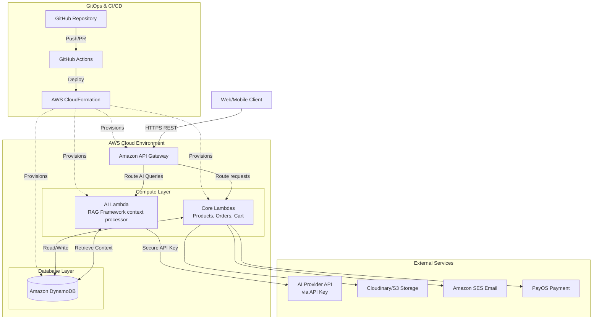
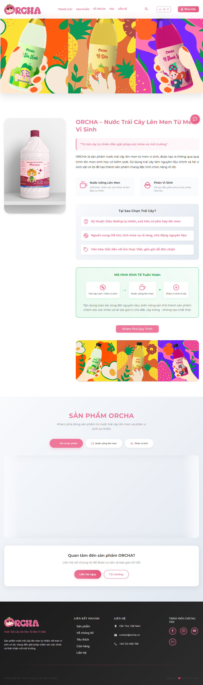
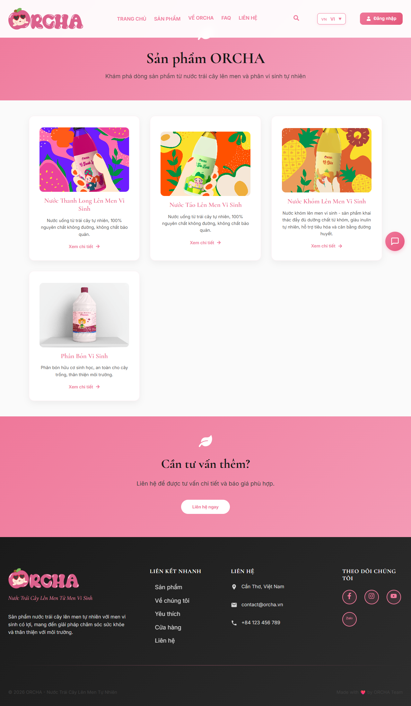
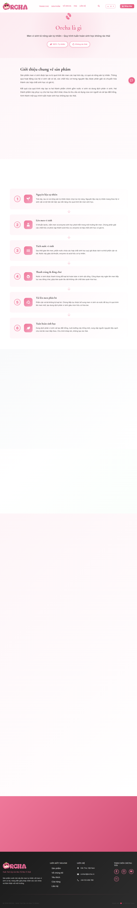
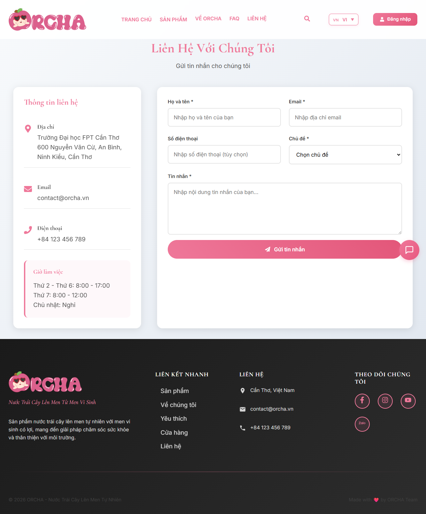

<p align="center">
  
</p>

# ORCHA – Fermented Drinks & Bio-Fertilizer Cloud Platform

ORCHA is a comprehensive, bilingual (VI/EN) e-commerce and marketing platform. It showcases and sells fermented fruit drinks and bio-fertilizer products, highlighting ORCHA’s commitment to a circular production process.

This project is built with a **Cloud-First** approach, leveraging a robust Serverless Backend on AWS to ensure massive scalability, high availability, and optimal performance, alongside a modern React Frontend.

---

## ☁️ Cloud & Architecture (AWS Serverless & GitOps)

The ORCHA backend is engineered for high performance and zero-maintenance scaling, built entirely on **AWS Serverless architecture** and fully automated through **GitOps**. We also integrated an **AI RAG (Retrieval-Augmented Generation) Framework** via AWS Lambda.

### System Architecture



### Core Cloud Technologies
- **GitOps & Infrastructure as Code (IaC):** Deployed via GitHub Actions pipelines. AWS CloudFormation (CF) and AWS SAM (`template.yaml`) provision the infrastructure automatically.
- **Compute Layer (AWS Lambda):** All business logic is executed via highly optimized Go (1.x) functions.
- **AI RAG Integration:** A dedicated AI Lambda uses API Keys to connect with external LLM providers. It uses the RAG framework to process contextual data from DynamoDB and generate accurate AI responses for the platform.
- **API Management (Amazon API Gateway):** Connects all services, routing user requests securely to the respective Lambdas.
- **NoSQL Database (Amazon DynamoDB):** Fully managed database handling Products, Orders, Users, and context data for the AI.
- **Authentication & Security:** Amazon Cognito handles user identities.

---

## 💻 Frontend & UI Showcase

The frontend delivers a premium, app-like experience built with **React 18, Vite, and TypeScript**.

### Application Screenshots

<details open>
<summary><b>🏠 Home Page</b></summary>
<br/>
<p align="center">
  
</p>
</details>

<details open>
<summary><b>🛍️ Products Page</b></summary>
<br/>
<p align="center">
  
</p>
</details>

<details>
<summary><b>📖 About Us Page</b></summary>
<br/>
<p align="center">
  
</p>
</details>

<details>
<summary><b>📞 Contact Page</b></summary>
<br/>
<p align="center">
  
</p>
</details>

---

## 📦 Project Structure

```text
.
├── orcha-backend/          # ☁️ AWS Serverless Backend (Go)
│   ├── functions/          # Go Lambda handlers (AI, cart, orders, products)
│   ├── pkg/                # Shared Go packages
│   ├── template.yaml       # AWS SAM IaC definition
│   └── Makefile            # Backend build scripts
├── src/                    # 💻 React Frontend
│   ├── assets/             # Images, Screenshots, Logos
│   ├── components/         # Reusable UI components
│   ├── contexts/           # Global states (Auth, Language)
│   ├── pages/              # Main view components
│   ├── services/           # Cloud API & AI integration handlers
│   └── styles/             # Global CSS and Modules
├── .github/workflows/      # ⚙️ GitOps CI/CD Actions for Cloud Deployments
└── package.json            # Frontend dependencies
```

---

## 🚀 Getting Started

### ☁️ Backend Setup (AWS SAM)
1. **Prerequisites:** Install Go (v1.20+) and AWS SAM CLI.
2. **Navigate:** `cd orcha-backend`
3. **Build:** 
   ```bash
   go mod download
   sam build
   ```
   *(Note: Local deployment is locked out to enforce GitOps/CI-CD rules).*

### 💻 Frontend Setup
1. **Prerequisites:** Node.js (v18+).
2. **Install Dependencies:** `npm install`
3. **Environment Variables:**
   Copy `.env.example` to `.env` and fill in your AWS API Gateway URL, AI API Keys, and Cognito details.
4. **Run Development Server:** `npm run dev`

---

## 🚢 CI/CD & Cloud Deployment Policy

ORCHA employs strict continuous deployment practices using a **GitOps approach**. Local deployments are prohibited to maintain the integrity of the Cloud environment via CloudFormation.

- **Frontend Deploy:** Handled by `.github/workflows/deploy-frontend.yml` (deploying to static hosting).
- **Backend Deploy:** Handled by `.github/workflows/deploy-backend.yml` (deploying via AWS CloudFormation).
- **Automated Testing:** Triggered via `.github/workflows/ci-build-test.yml` on PRs.

### Required GitHub Secrets
- `AWS_ACCESS_KEY_ID` & `AWS_SECRET_ACCESS_KEY`
- `ADMIN_EMAIL` & `CLOUDINARY_URL`
- `COGNITO_USER_POOL_ID` & `COGNITO_USER_POOL_ARN`
- `AI_API_KEY` (For the AI RAG Lambda)

---


## 📄 License
All rights reserved by **ORCHA**.
